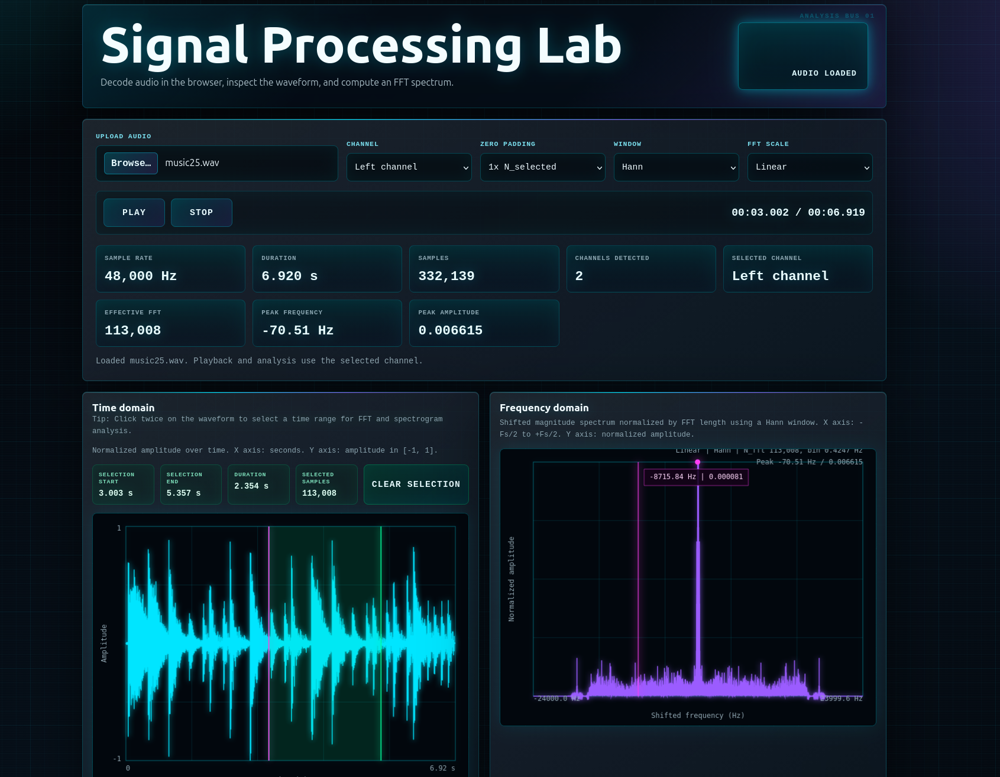

# Signal Processing Lab

## Overview

Signal Processing Lab is a small browser-based audio DSP playground, made with Codex.

The idea is simple: load an audio file, pick a channel, look at the waveform, choose a time region, and see what its frequency content looks like. It is the kind of tool I wanted while poking around with FFTs, windows, spectrograms, and the little details that make signals feel less abstract.

Everything runs locally in the browser. There is no backend, no API, no build step, and no dependency stack hiding behind the page. Just HTML, CSS, JavaScript, the Web Audio API, and a fair amount of DSP code written by hand.

<div align="center">
  
</div>

## Live Demo

This project is designed to work on GitHub Pages as a static site.

If you are running it locally, start a small HTTP server and open the page in your browser:

```bash
python3 -m http.server 8000 -d projects/signal-processing-lab
```

Then visit:

```text
http://localhost:8000
```

If port `8000` is busy, use another one:

```bash
python3 -m http.server 8010 -d projects/signal-processing-lab
```

## Preview

The app has a dark oscilloscope-inspired interface with neon signal traces, measurement-style readouts, and responsive canvas plots.

Main views:

- time-domain waveform
- shifted frequency spectrum centered around `0 Hz`
- STFT spectrogram
- playback controls with a moving waveform playhead
- measurement cards for sample rate, duration, channel count, FFT length, and peak frequency

A useful workflow is:

1. Upload an audio file.
2. Select left, right, or mono average.
3. Click twice on the waveform to choose a time range.
4. Compare how different windows, zero padding, and FFT scales change the spectrum.
5. Check the spectrogram to see how the frequency content changes over time.

## Features

- Load local audio files in the browser.
- Supports formats your browser can decode, commonly WAV, MP3, and OGG.
- Select the analysis channel:
  - left channel
  - right channel
  - mono average across channels
- Play, pause, and stop audio using the Web Audio API.
- Playback follows the selected channel.
- If a waveform range is selected, playback uses that selected segment.
- Moving playhead on the waveform during playback.
- Audio metadata display:
  - sample rate
  - duration
  - sample count
  - detected channels
  - selected channel
- Time-domain waveform with min/max decimation for large files.
- Click twice on the waveform to select a time range.
- Clear the selected range with one button.
- FFT analysis from either the full selected channel or the selected time range.
- Zero padding options based on the active analysis segment:
  - `1x N_selected`
  - `2x N_selected`
  - `4x N_selected`
  - `8x N_selected`
- Window options:
  - Rectangular
  - Hann
  - Hamming
  - Blackman
- Shifted FFT display by default, centered around `0 Hz`.
- Frequency axis runs from about `-Fs/2` to `+Fs/2`.
- FFT amplitude normalized by the effective FFT length.
- Linear and dB spectrum scale modes.
- Frequency hover cursor with readout.
- Peak frequency and peak amplitude detection.
- Spectrogram using STFT:
  - window sizes from `256` to `4096`
  - hop sizes of `25%`, `50%`, and `75%`
  - magnitude shown in dB
- Responsive layout for desktop and smaller screens.

## Technologies

This project intentionally stays close to the browser platform:

- HTML
- CSS
- JavaScript
- Web Audio API
- Canvas 2D API
- DOM APIs

No external libraries are used.

DSP pieces implemented in JavaScript include:

- channel extraction and mono averaging
- signal normalization
- waveform decimation
- window generation
- radix-2 FFT
- Bluestein FFT support for non-power-of-two lengths
- FFT shifting
- normalized magnitude calculation
- dB conversion
- STFT spectrogram generation
- peak frequency detection

## Local Usage

From the workspace root:

```bash
python3 -m http.server 8000 -d projects/signal-processing-lab
```

Open:

```text
http://localhost:8000
```

Using the app:

1. Upload an audio file.
2. Choose the channel you want to inspect.
3. Use the waveform as the time reference.
4. Click twice on the waveform if you want to analyze only part of the sound.
5. Try different windows and FFT scales.
6. Use the spectrogram when the signal changes over time.

A note on audio formats: decoding depends on the browser. If a file does not load, try a simple WAV file first.

## Future Ideas

Some directions that would be fun to explore:

- export waveform, FFT, or spectrogram data as CSV
- export plots as images
- add log-frequency display
- add filter experiments such as low-pass, high-pass, and band-pass
- add generated test signals like sine, noise, chirp, and square waves
- add RMS, peak, crest factor, and DC offset measurements
- add zooming and panning on the waveform
- add better multichannel support for files with more than two channels
- move heavier analysis into a Web Worker for very long files

This is not meant to replace a serious DSP package. It is a compact lab bench for exploring signals directly in the browser, and that is exactly what makes it fun.
